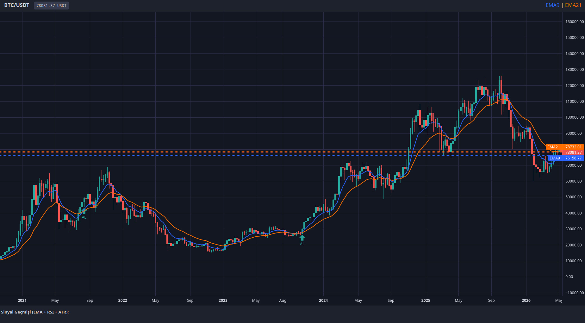

# Trend-Following Momentum Strategy with Volatility Filtering Algorithm Example with Vis-Algo Boilerplate

## English Version

### Boilerplate HTML for Trading Algorithm Enthusiasts
This repository provides a lightweight, real-time visualization boilerplate for trading algorithm development. It is designed for researchers and developers to visualize signals immediately via TradingView's lightweight-charts interface. You can scale this infrastructure by routing data to high-performance Python backends (e.g., FastAPI with PyTorch/TensorFlow) or execute machine learning inferences client-side using JavaScript-based neural network frameworks.

### Application Preview

---

### Client-Side JavaScript Neural Network Frameworks
If you intend to implement machine learning directly within the browser without setting up a Python backend service, utilize these frameworks:

* **TensorFlow.js:** [https://www.tensorflow.org/js](https://www.tensorflow.org/js) - Complete hardware-accelerated ecosystem for training and deploying deep learning models in JavaScript.
* **Brain.js:** [https://brain.js.org/](https://brain.js.org/) - Simple, fast neural network library for JavaScript suited for feed-forward and LSTM architectures.
* **Synaptic.js:** [http://caza.la/synaptic/](http://caza.la/synaptic/) - Architecture-free neural network library for node.js and the browser, allowing generalized network topologies.

---

### Supported State-of-the-Art (SOTA) & Classical Architectures

#### 1. SOTA Deep Learning & Foundation Models (arXiv)
* **RAFT (Retrieval-Augmented Time-Series Forecasting)**
  * *Mechanics:* Extracts historical sequence candidates from the database with patterns matching the current target lookback window, using past explicit representations to circumvent parameter bottlenecks.
  * *arXiv Link:* [https://arxiv.org/abs/2505.04163](https://arxiv.org/abs/2505.04163)
* **TSMixer (Lightweight All-MLP Architecture)**
  * *Mechanics:* Replaces heavy self-attention mechanisms with multi-layer perceptrons that mix features across temporal and channel dimensions, significantly reducing latency.
  * *arXiv Link:* [https://arxiv.org/abs/2303.06053](https://arxiv.org/abs/2303.06053)
* **SE-LLM (Semantic-Enhanced Large Language Model Forecasting)**
  * *Mechanics:* Embeds raw time-series components into textual prototypes, activating pre-trained language model transformers for cross-domain sequence mapping.
  * *arXiv Link:* [https://arxiv.org/abs/2508.07697](https://arxiv.org/abs/2508.07697)
* **RAF (Retrieval Augmented Forecasting for TSFMs)**
  * *Mechanics:* A zero-shot framework built for large Time-Series Foundation Models (e.g., Chronos, TimesFM) using cross-context retrieval to optimize forecasting steps.
  * *arXiv Link:* [https://arxiv.org/abs/2411.08249](https://arxiv.org/abs/2411.08249)

#### 2. Classical Quantitative & Online Portfolio Selection (OLPS) Algorithms
* **OLMAR (Online Moving Average Reversion)**
  * *Mechanics:* Predicts upcoming price-relative vectors assuming asset prices systematically revert to multi-period moving averages, solving a distance-minimizing portfolio distribution.
  * *arXiv Link:* [https://arxiv.org/abs/1212.2129](https://arxiv.org/abs/1212.2129)
* **PAMR (Passive Aggressive Mean Reversion)**
  * *Mechanics:* Formulates mean reversion using a passive-aggressive loss function, updating portfolio allocations dynamically when unexpected price movements exceed risk tolerances.
  * *arXiv Link:* [https://arxiv.org/abs/1212.2129](https://arxiv.org/abs/1212.2129)
* **Info-Proj EG (Information-Projection Exponentiated Gradient)**
  * *Mechanics:* Treats single-period Constant Relative Risk Aversion (CRRA) allocation choices as an information-projection optimization, updating transaction weights via Rényi divergence bounds.
  * *arXiv Link:* [https://arxiv.org/abs/2605.03184](https://arxiv.org/abs/2605.03184)

This is under MIT License. Free to use commercially and personally.
  
---
---

## Türkçe Versiyon

### Algoritma Ticareti Meraklıları İçin Şablon HTML
Bu depo, ticaret algoritması geliştirme süreçleri için hafif ve gerçek zamanlı bir görselleştirme şablonu sunmaktadır. Araştırmacıların ve geliştiricilerin sinyalleri TradingView `lightweight-charts` arayüzü üzerinden anlık olarak izlemesi için tasarlanmıştır. Bu altyapıyı, verileri yüksek performanslı Python arka uçlarına (örneğin PyTorch/TensorFlow destekli FastAPI) yönlendirerek büyütebilir veya JavaScript tabanlı yapay sinir ağı kütüphaneleriyle doğrudan tarayıcı üzerinde makine öğrenimi çıkarımları yapabilirsiniz.

### Uygulama Önizlemesi

---

### Tarayıcı Tabanlı JavaScript Yapay Sinir Ağı Kütüphaneleri
Bir Python sunucu altyapısı kurmadan makine öğrenimi modellerini doğrudan tarayıcı üzerinde çalıştırmak istiyorsanız aşağıdaki kütüphaneleri kullanabilirsiniz:

* **TensorFlow.js:** [https://www.tensorflow.org/js](https://www.tensorflow.org/js) - JavaScript ile derin öğrenme modelleri eğitmek ve dağıtmak için donanım hızlandırmalı ekosistem.
* **Brain.js:** [https://brain.js.org/](https://brain.js.org/) - Feed-forward ve LSTM mimarileri için uygun, hızlı ve basit yapay sinir ağı kütüphanesi.
* **Synaptic.js:** [http://caza.la/synaptic/](http://caza.la/synaptic/) - Node.js ve tarayıcı için mimariden bağımsız, genel ağ topolojileri oluşturmaya izin veren kütüphane.

---

### Desteklenen Son Teknoloji (SOTA) ve Klasik Algoritmalar

#### 1. SOTA Derin Öğrenme ve Temel Modeller (arXiv)
* **RAFT (Retrieval-Augmented Time-Series Forecasting)**
  * *Çalışma Mantığı:* Veri tabanından mevcut veri penceresine en benzer geçmiş örüntü adaylarını çıkararak parametre darboğazlarını aşmak amacıyla model girdisine explicit geçmiş temsiller ekler.
  * *arXiv Bağlantısı:* [https://arxiv.org/abs/2505.04163](https://arxiv.org/abs/2505.04163)
* **TSMixer (Lightweight All-MLP Architecture)**
  * *Çalışma Mantığı:* Ağır self-attention katmanları yerine zaman ve kanal boyutlarında özellikleri harmanlayan çok katmanlı algılayıcılar (MLP) kullanarak işlem gecikmesini (latency) büyük ölçüde azaltır.
  * *arXiv Bağlantısı:* [https://arxiv.org/abs/2303.06053](https://arxiv.org/abs/2303.06053)
* **SE-LLM (Semantic-Enhanced Large Language Model Forecasting)**
  * *Çalışma Mantığı:* Zaman serisi bileşenlerini metinsel prototiplere dönüştürerek önceden eğitilmiş büyük dil modellerinin çoklu alan modelleme yeteneklerini zaman serisi tahminlemede kullanır.
  * *arXiv Bağlantısı:* [https://arxiv.org/abs/2508.07697](https://arxiv.org/abs/2508.07697)
* **RAF (Retrieval Augmented Forecasting for TSFMs)**
  * *Mechanics:* Büyük Zaman Serisi Temel Modelleri (Chronos, TimesFM gibi) için tasarlanmış, parametre ince ayarı yapmadan bağlamsal arama ile sonraki adımları optimize eden sıfır-atışlı (zero-shot) bir çerçevedir.
  * *arXiv Bağlantısı:* [https://arxiv.org/abs/2411.08249](https://arxiv.org/abs/2411.08249)

#### 2. Klasik Kantitatif ve Çevrimiçi Portföy Seçimi (OLPS) Algoritmaları
* **OLMAR (Online Moving Average Reversion)**
  * *Çalışma Mantığı:* Varlık fiyatlarının sistematik olarak çok periyotlu hareketli ortalamalarına geri döneceğini varsayarak gelecek fiyat vektörlerini tahmin eder ve mesafe minimizasyonu hedefleyen portföy dağılımları hesaplar.
  * *arXiv Bağlantısı:* [https://arxiv.org/abs/1212.2129](https://arxiv.org/abs/1212.2129)
* **PAMR (Passive Aggressive Mean Reversion)**
  * *Çalışma Mantığı:* Ortalamaya dönüşü pasif-agresif bir kayıp fonksiyonu ile formüle eder; beklenmeyen fiyat hareketleri risk tolerans limitlerini aştığında portföy dağılımlarını agresif bir şekilde günceller.
  * *arXiv Bağlantısı:* [https://arxiv.org/abs/1212.2129](https://arxiv.org/abs/1212.2129)
* **Info-Proj EG (Information-Projection Exponentiated Gradient)**
  * *Çalışma Mantığı:* Tek periyotlu Sabit Göreli Riskten Kaçınma (CRRA) seçimlerini bir bilgi projeksiyonu problemi olarak ele alır ve işlem ağırlıklarını Rényi diverjans sınırları üzerinden günceller.
  * *arXiv Bağlantısı:* [https://arxiv.org/abs/2605.03184](https://arxiv.org/abs/2605.03184)
  
MIT Lisansı altındadır. Ücretsiz olarak ticari ve kişisel kullanılabilir. 

